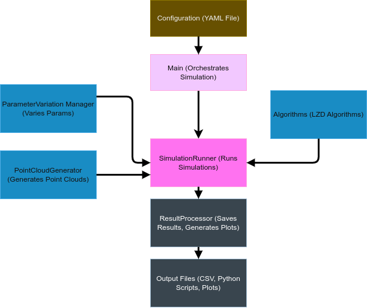
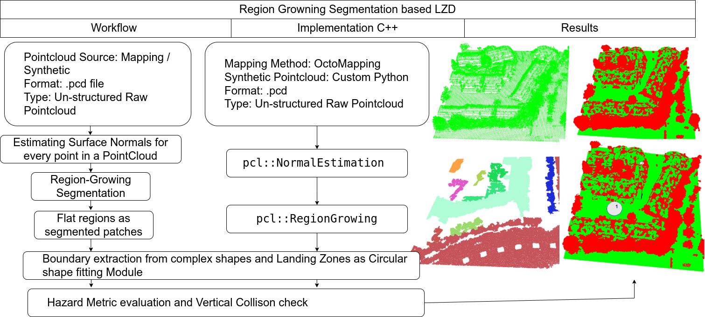
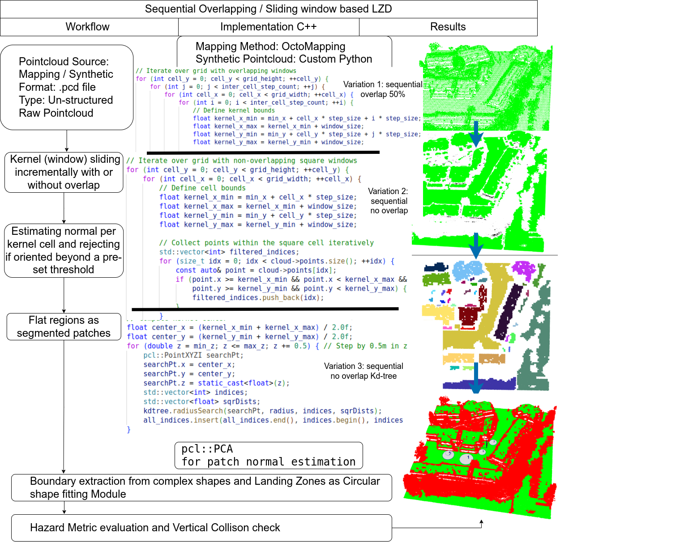
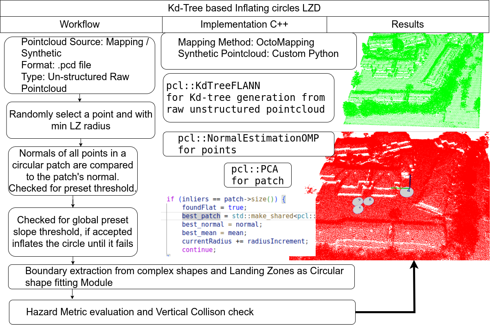
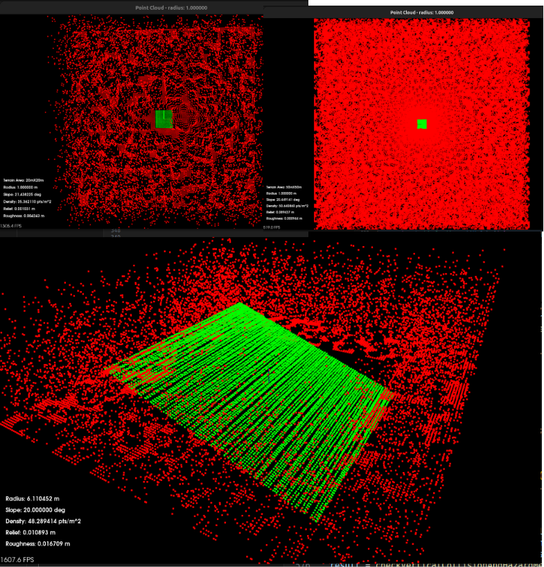

# Drone-Delivery-Landing-Zone-Detection: Algorithms & Benchmarking Framework 


This repository focuses on two core components:
- 🧠 **Drone-Delivery-Landing-Zone-Detection (DLZD) Algorithms**
- 📊 **Proposed Benchmarking Strategy** for evaluating those algorithms

---

## 📁 Benchmarking Framework Configuration

The benchmarking parameters—such as pre-set heuristic hazard metrics specific to the UAV and use case—can be configured in:

```
lib/config/monte_carlo_benchmarking_config.yaml
```

More options will be added as new algorithms are integrated.

🧠 **Currently implemented algorithms** are listed in:

```
lib/include/architecture.h
```

Look under the comment:
```cpp
// ALGORITHMS ..............
```
-kdtreeNeighbourhoodPCAFilterOMP -> Kdtree based nearest neighbourhood point search applied to inflating circles algorithm
-sequentialOverlappingApproach -> Voxelized pointcloud is processed sequentially voxel wise with adjustable overalpping between each voxels
-sequentialApproach -> Voxelized pointcloud is processed sequentially voxel wise
-sequentialApproachKdtree -> Kdtree based nearest neighbour point search and sequentially processing
-segmentPointCloud -> Region Growing segmentation based
 
## For detailed explaination please refer the published paper at Drone-Delivery-Landing-Zone-Detection/media/DASC_2025.pdf
---

## 🚀 Quickstart

### 1. Environment Setup

> **Note**: If using NVIDIA GPU, ensure that NVIDIA drivers and the container toolkit are installed.

Pull the pre-built Docker image with all dependencies:

```bash
docker pull giri6937/lam:latest
```

Clone the repository:

```bash
cd /your/desired/workspace
git clone https://github.com/EXPX3/Drone-Delivery-Landing-Zone-Detection.git
```

Run the Docker container and mount the repository:

```bash
sudo docker run --name DDLZD --rm -it --privileged \
-e DISPLAY=$DISPLAY -e XAUTHORITY=$XAUTHORITY \
-v /tmp/.X11-unix:/tmp/.X11-unix \
-v /PATH_TO_YOUR_CLONED_REPO_DIR/Drone-Delivery-Landing-Zone-Detection:/home/airsim_user/Drone-Delivery-Landing-Zone-Detection \
--gpus all --network host --entrypoint /bin/bash giri6937/lam:latest
```

> Skip `--gpus all` if not using GPU.

---

### 2. Building the Project

Inside the container:

```bash
cd /home/airsim_user/Drone-Delivery-Landing-Zone-Detection/lib
mkdir build && cd build
cmake ..
make
```

A successful build generates an executable named `main`.

---

### 3. Running the Benchmark

Configure the YAML file first. For a quick test:
- Set `iterations: 1`
- Enable `visualization: true` to observe point cloud generation

Run the benchmark:

```bash
./main
```

> **Note**: You'll need to press `q` 175 times in total for a single iteration over 5 hazard metrics × 7 values × 5 algorithms, so feel free to stop the main by pressing ctrl + c after seeing the process visually for few steps.

For full benchmarking:
- Set `visualization: false`
- Set `iterations: 20` or more. More iterations more time more accuracy of results. Note: after certain number of iterations results might not change much.

Results are saved in:

```
Drone-Delivery-Landing-Zone-Detection/results/
```

---

### 4. Plotting the Results 📈

Activate your Python virtual environment and run:

```bash
python Drone-Delivery-Landing-Zone-Detection/scripts/results_plotter.py
```

Plots will be saved under a timestamped folder:

```
results/results_<timestamp>/plots_<timestamp>/
```

---

## 🧪 Testing on Your Own Point Cloud

1. Exit the current container session.
2. Update `config_path` to use `algo_testing_config.yaml`.
3. Mount your PCD directory:

```bash
sudo docker run --name DDLZD --rm -it --privileged \
-e DISPLAY=$DISPLAY -e XAUTHORITY=$XAUTHORITY \
-v /tmp/.X11-unix:/tmp/.X11-unix \
-v /PATH_TO_YOUR_CLONED_REPO_DIR/Drone-Delivery-Landing-Zone-Detection:/home/airsim_user/Drone-Delivery-Landing-Zone-Detection \
-v /PATH_TO_YOUR_OWN_PCD_FILES/pcds:/home/airsim_user/Drone-Delivery-Landing-Zone-Detection/pcds \
--gpus all --network host --entrypoint /bin/bash giri6937/lam:latest
```

4. Set your `.pcd` path in `algo_testing_config.yaml`.
5. Enable visualization and run the test.

> Zoom out if the point cloud is not immediately visible. Press `q` to continue the process.

---

## 🧱 Simulation Framework



---

## ✅ Implemented Algorithms

### 1. Traditional Rule-Based Models with Heuristic Rules
- `Region_Growing_Segmentation`
- `seq_overlap`
- `kdtree_InflatingCircles`
- `sequentialApproachKdtree`
- `sequentialApproach`

> These algorithms are integrated into the Monte Carlo-based benchmarking strategy.

---

## 🎥 Visualizations

### Algorithm Demonstrations

| Algorithm                   | Visualization |
|----------------------------|----------------|
| Region_Growing_Segmentation |  |
| seq_overlap                |  |
| kdtree_InflatingCircles    |  |

---

### Synthetic Point Clouds

Synthetic point clouds generated:



> **Note**: For a detailed explanation of the implementation with flow charts and pseudocode, refer to the paper published here (to be released by end of August 2025).

---

## ⚙️ Configuration

We use a `.yaml` file to configure algorithm selection and their parameters. You will find the self-explanatory file at:

```
Drone-Delivery-Landing-Zone-Detection/lib/config/monte_carlo_benchmarking_config.yaml
```

---

## 📌 What’s Next

- Adding a DL-based DLZD algorithm and benchmarking it.

> **Note**: More details will be added soon.

---
