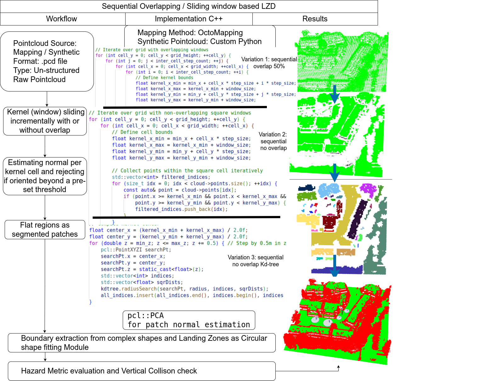

# Drone-Delivery-Landing-Zone-Detection

**Algorithms and Benchmarking Strategies**

---

## Overview

Implemented algorithms to date and included in the Monte-carlo based benchmarking strategy.

### Algorithms Implemented

1. **Traditional Rule-Based Mathematical Models with Preset Heuristic Rules**:
    - Region_Growing_Segmentation
    - seq_overlap
    - kdtree_InflatingCircles
    - sequentialApproachKdtree
    - sequentialApproach

---

## Visualizations

| Algorithm                     | Visualization                              |
|-------------------------------|--------------------------------------------|
| **Region_Growing_Segmentation** |  |
| **seq_overlap**               |           |
| **kdtree_InflatingCircles**   |  |

> **Note**: For detailed explanation of implementation with flow charts and pseudo code, refer to the paper published here (published by end of Aug 2025).

synthetic point clouds generated:

---

## Configuration

We use a `.yaml` file to configure algorithm selection and their parameters. You will find the self-explanatory file at the following path: Drone-Delivery-Landing-Zone-Detection/lib/config/monte_carlo_benchmarking_config.yaml

NOTE: More details will be added soon.